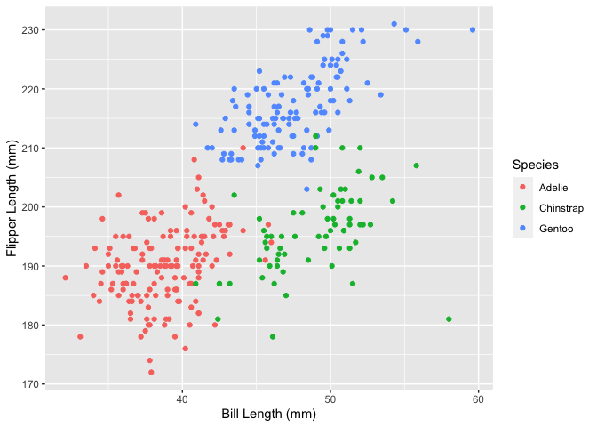

p8105\_hw1\_jae2186
================
jae2186 (Jennifer Estrada)
9/29/2021

## Problem 1

This first data frame includes the following:

-   a random sample of size 10 from a standard Normal distribution,
-   a logical vector indicating whether elements of the sample are
    greater than 0,
-   a character vector of length 10, and
-   a factor vector of length 10, with 3 different factor “levels” -
    here they are noted as `green`, `blue`, and `purple`.

``` r
set.seed(1)

p1_df <- tibble(rsamp = rnorm(10),
                vec_log = rsamp > 0,
                vec_char = c("this", "is", "a", 
                             "character", "vector", "that", 
                             "is", "ten", "characters",
                             "long"),
                vec_factor = factor(c("green", "green","blue", 
                                      "blue","blue", "blue", 
                                      "blue", "purple","purple", 
                                      "purple"))
)

p1_df
```

    ## # A tibble: 10 × 4
    ##     rsamp vec_log vec_char   vec_factor
    ##     <dbl> <lgl>   <chr>      <fct>     
    ##  1 -0.626 FALSE   this       green     
    ##  2  0.184 TRUE    is         green     
    ##  3 -0.836 FALSE   a          blue      
    ##  4  1.60  TRUE    character  blue      
    ##  5  0.330 TRUE    vector     blue      
    ##  6 -0.820 FALSE   that       blue      
    ##  7  0.487 TRUE    is         blue      
    ##  8  0.738 TRUE    ten        purple    
    ##  9  0.576 TRUE    characters purple    
    ## 10 -0.305 FALSE   long       purple

The following code chunk takes the mean of each variable:

``` r
mean_rsamp <- mean(pull(p1_df, var = 1))
mean_log <- mean(pull(p1_df, var = 2))
mean_char <- mean(pull(p1_df, var = 3))
mean_factor <- mean(pull(p1_df, var = 4))
```

When taking the mean of each variable in the dataframe `p1_df` only the
random sample and logical vector return values. The random sample
variables return a mean of 0.13. The logical vector converted `true`
into 1 and `false` into 0; given that there were 6 `true` and 4 `false`
values, the mean was 0.6. Otherwise warning messages appear for the
character and factor vectors as they are not numeric nor logical.

The following is then a code chunk that applies the `as.numeric`
function to the logical, character, and factor variables:

``` r
log_asnum <- as.numeric(p1_df$vec_log)

char_asnum <- as.numeric(p1_df$vec_char)

factor_asnum <- as.numeric(p1_df$vec_factor)
```

When the `as.numeric` function is applied:

-   the logical variable is converted to a numeric value column then the
    `true` and `false` values are converted to 1 and 0, respectively.

-   the character variable still cannot be converted to values and
    coerces `NA` to replace each input.

-   the factor variable is has an integer assigned to each factor level
    in alphabetical order such that with the three factors `green` is
    coded as 2, `blue` is coded as 1, and `purple` is coded as 3.

Again, because the characters have no obvious values they cannot be
converted to a numeric scale and the mean cannot be derived from this
variable. However, the logical values are consistent to how the binary
variable was previously coded when calculating the mean initially. The
factor variable has changed with a numeric value applied to each level
and a mean can now be calculated.

## Problem 2

First the `penguins` dataset is loaded.

``` r
data("penguins", package = "palmerpenguins")
```

The `penguins` dataset includes:

-   8 different variables for 344 entries

-   variables that describe qualitative demographic information about
    each subject including:

    -   which of 3 `species` the pengiun is,
    -   the pengiun `sex`, and
    -   at which one of 3 `island` locations the penguin was found.

-   variables that provide quantitative demographic information
    including:

    -   year of data collection (under `year`),
    -   bill length (in mmm, under `bill_length_mm`),
    -   bill depth (in mm, under `bill_depth_mm`),
    -   flipper length (in mm, under `flipper_length_mm`), and
    -   body mass (in g, under `body_mass_g`).

Some general statistics for this sampling population include:

-   a mean bill length of 43.92 mm from 342 values,

-   a mean bill depth of 17.15 mm from 342 values,

-   <b> a mean flipper length depth of 200.92 mm from 342 values</b>,
    and

-   a mean body mass of 4201.75 g from 342 values.

``` r
ggplot(penguins, aes(x = bill_length_mm, y = flipper_length_mm, color = species)) +
  geom_point() + 
  labs(x = "Bill Length (mm)", y = "Flipper Length (mm)", colour = "Species")
```

<!-- -->

``` r
ggsave("p8105_hw1_p2_jae2186.pdf")
```
